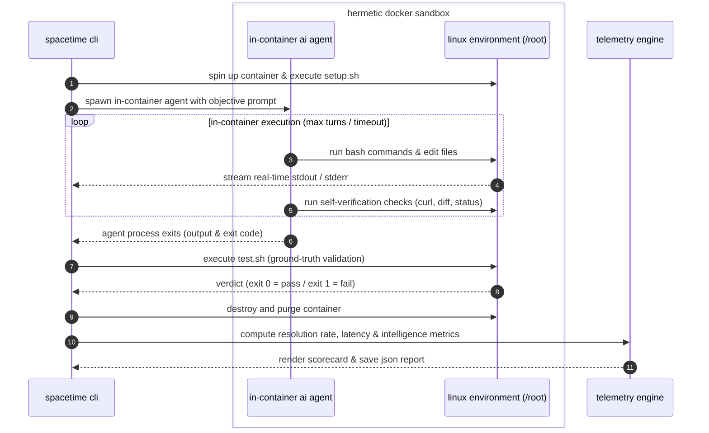

<p align="center">
  
</p>

<h4 align="center">a benchmark for evaluating ai agents on interactive terminal tasks</h4>

spacetime evaluates ai agents inside isolated docker containers on real terminal challenges like fixing broken nginx servers, resolving git conflicts, parsing logs, and repairing port clashes. solutions are tested against strict test assertions to verify what actually works.

```bash
curl -fsSL https://spacetime.trydecember.com | bash
```

### how it works

- starts a fresh, isolated docker container
- gives the agent terminal access to fix the task
- streams live terminal output in real time
- runs automated tests to verify the solution
- cleans up and generates the final scorecard


