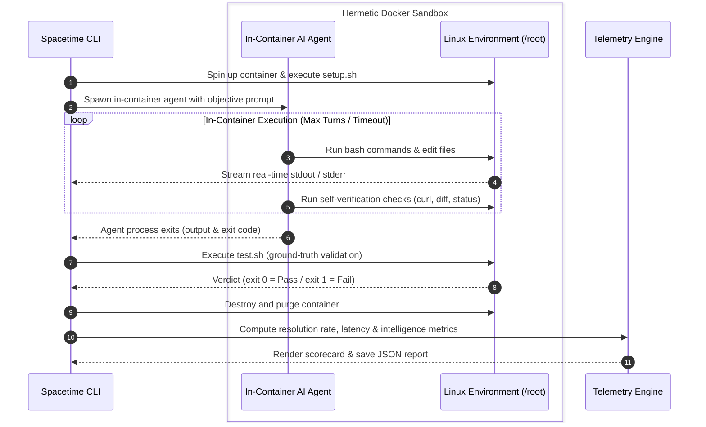

<p align="center">
  
</p>

<h4 align="center">A benchmark for evaluating AI agents on interactive terminal tasks</h4>

Spacetime evaluates AI agents inside isolated Docker containers on real terminal challenges like fixing broken Nginx servers, resolving Git conflicts, parsing logs, and repairing port clashes. Solutions are tested against strict test assertions to verify what actually works.

It runs agents through 50 embedded Linux environments covering sysadmin, networking, debugging, and data pipelines. Beyond basic pass/fail checks, Spacetime captures deep telemetry across the execution lifecycle—tracking pass rates, latency, turn efficiency, error recovery, token economics & cost, and self-verification behavior.

```bash
curl -fsSL https://spacetime.trydecember.com | bash
```


### How It Works

- Starts a fresh, isolated Docker container
- Gives the agent terminal access to fix the task
- Streams live terminal output in real time
- Runs automated tests to verify the solution
- Cleans up and generates the final scorecard

### Task Structure

Each task is self-contained with four simple files:
- `prompt.txt` - The objective presented to the agent
- `setup.sh` - Prepares the broken state inside the fresh container
- `test.sh` - Ground-truth test assertions
- `meta.sh` - Task metadata, timeout, and turn configuration



To contribute or add tasks, open a PR. For help, reach out at team@trydecember.com.

