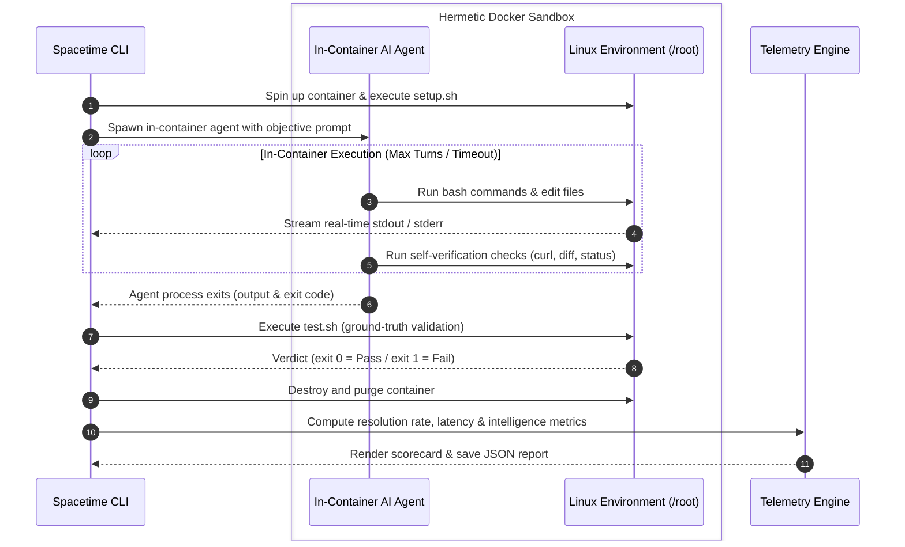

# ✱ Spacetime

Spacetime is a benchmark for evaluating AI agents on interactive terminal tasks.
It executes agents inside isolated Docker containers to solve realistic Linux problems and tests if their solutions actually work.

- **Clean Docker Sandboxes:** Every task runs in a fresh, isolated container so nothing leaks between test runs.
- **Works with Any Agent:** Ready-to-use support for Claude Code, Gemini CLI, Codex, Aider, OpenHands, and custom agent scripts.
- **Smart Performance Insights:** Tracks pass rates, speed, error recovery, and how well agents verify their own work.
- **Simple Interactive CLI:** A step-by-step terminal wizard to pick your agent, choose models, and run benchmarks in seconds.

```bash
curl -fsSL https://spacetime.trydecember.com | bash
```


