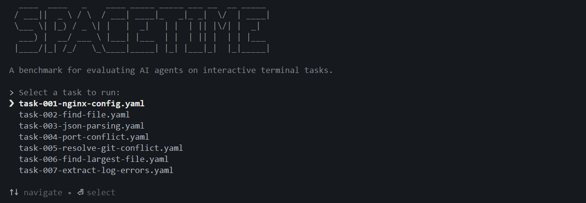
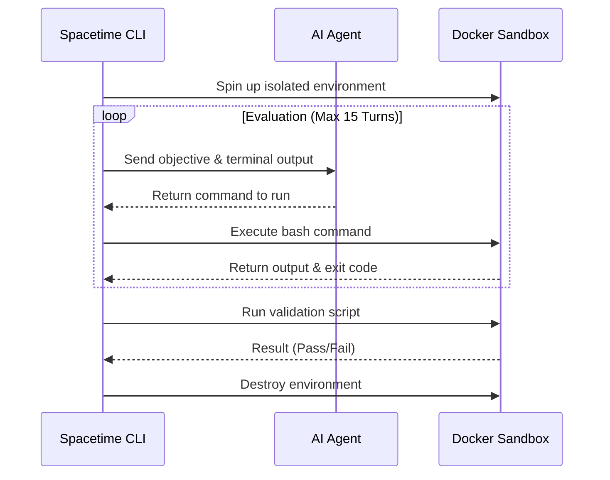

# Spacetime

Spacetime is a minimalist framework that evaluates autonomous AI agents by dropping them into isolated Docker sandboxes and testing their ability to execute commands and solve system-level problems.

- **Terminal-Native**: Specifically designed to evaluate agent performance on shell scripting, file manipulation, networking, and CLI debugging.
- **Docker Isolation**: Every terminal task is evaluated inside an ephemeral sandbox that is cleanly destroyed upon completion.
- **Action-Observation Loop**: Captures live agent thoughts, standard output (stdout), and exit codes across a strict 15-turn limit.
- **Built-in Task Suite**: Includes 20 distinct terminal challenges, ranging from resolving port conflicts to extracting log errors.
- **Multi-Model Support**: Compare terminal reasoning capabilities between OpenAI and Google Gemini.

