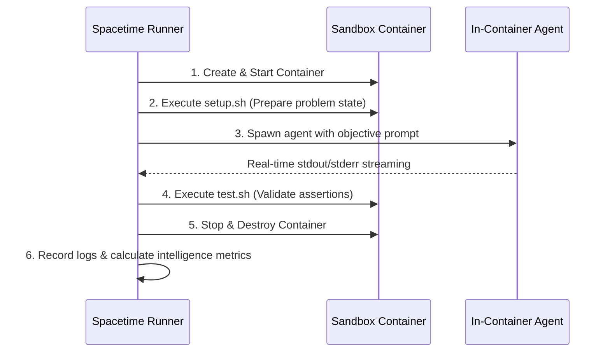

# ✱ Spacetime

> An in-container benchmark arena for evaluating terminal-using AI coding agents (Claude Code, Gemini CLI, Antigravity, OpenAI Codex, Aider, Devin, OpenHands, SWE-agent, and custom agents).

Spacetime executes AI agents directly inside hermetic Docker sandboxes against realistic Linux sysadmin, networking, debugging, and software engineering tasks. It measures both task completion accuracy and detailed agent behavioral telemetry.

---

## Features

- **Hermetic Docker Sandboxes:** Isolated, ephemeral containers prevent persistent state leakage between tasks.
- **Interactive TUI & Wizard:** Guided multi-step interface for selecting harnesses, models, and configuring API keys with custom ANSI themes.
- **17+ Agent Frameworks Supported:** Native presets for Claude Code, Gemini CLI, Antigravity (AGY), OpenAI Codex, Aider, Devin, December, Pi, Cursor CLI, SWE-agent, OpenHands, Goose, Plandex, Cline, Smolagents, Mentat, or custom CLI scripts.
- **Deep Intelligence Profiling:** Measures *First-Attempt Resolution Rate*, *Error Recovery Rate*, *Self-Verification Rate*, and *Context Hygiene*.
- **Domain Competency Breakdown:** Evaluates agents across Networking, Git, Security/Permissions, Data Processing, Dev Environments, Filesystem Operations, and Log Analysis.
- **Standardized Tasks:** Simple folder structure (`prompt.txt`, `setup.sh`, `test.sh`, `meta.sh` / `meta.toml`).

---

## Architecture & Task Lifecycle

Each benchmark execution runs through a 4-stage lifecycle:



---

## Quick Start

### Prerequisites

- **Docker:** Running Docker daemon (`docker info`)
- **Rust Toolchain:** Rust 1.75+ / Cargo
- **API Keys:** Export relevant keys in `.env` or your shell:
  ```bash
  export ANTHROPIC_API_KEY="your-key"
  export GEMINI_API_KEY="your-key"
  export OPENAI_API_KEY="your-key"
  ```

### Build & Run

1. **Launch the Interactive TUI Wizard:**
   ```bash
   cargo run --release
   ```

2. **List Benchmark Tasks:**
   ```bash
   cargo run -- list
   ```

3. **Inspect a Task:**
   ```bash
   cargo run -- info 001-nginx-config
   ```

4. **Run a Single Task with an Agent:**
   ```bash
   cargo run -- run 001-nginx-config --agent claude-code
   ```

5. **Run the Full 20-Task Benchmark Suite:**
   ```bash
   cargo run -- eval-all --agent claude-code --output results/claude_run.json
   ```

6. **Clean Up Ephemeral Containers:**
   ```bash
   cargo run -- clean
   # or
   ./sandbox.sh clean
   ```

---

## Task Structure

Creating a new task is as simple as adding a new folder under `tasks/`:

```
tasks/021-my-task/
├── meta.toml      # Task metadata, timeout, turn limits
├── prompt.txt     # The exact instruction given to the agent
├── setup.sh       # Script creating the broken state / environment
└── test.sh        # Validation script (exits with code 0 on pass)
```

### Example `meta.toml`:
```toml
TASK_ID = "021-my-task"
TASK_NAME = "Fix Broken Service"
BASE_IMAGE = "ubuntu:22.04"
MAX_TURNS = 15
TIMEOUT_SECS = 45
DESCRIPTION = "Resolve port conflict and restart systemd unit"
```

---

## CLI Reference

```
Usage: spacetime [OPTIONS] [COMMAND]

Commands:
  tui          Launch the interactive terminal UI wizard (default)
  run          Run a specific benchmark task against an agent
  eval-all     Run the full benchmark suite across all tasks
  build-image  Build or update the Docker sandbox image
  list         List all available benchmark tasks
  clean        Force-remove all dangling spacetime sandbox containers
  info         Show prompt, setup, and test scripts for a task
  help         Print this message or the help of the given subcommand(s)

Options:
  -a, --agent <AGENT>            Preset agent name (e.g. claude, gemini, agy, aider)
      --agent-cmd <AGENT_CMD>    Custom in-container command template
  -i, --image <IMAGE>            Docker sandbox image tag [default: spacetime-sandbox:latest]
      --timeout <TIMEOUT>        Task timeout override in seconds
      --force-rebuild            Force rebuild the Docker sandbox image
  -t, --tasks-dir <TASKS_DIR>    Path to tasks directory [default: tasks]
  -h, --help                     Print help
  -V, --version                  Print version
```

---

## Sandbox Helper Script (`./sandbox.sh`)

Spacetime includes a companion shell helper:

```bash
./sandbox.sh start    # Build/verify the sandbox docker image
./sandbox.sh stop     # Force-stop all running spacetime containers
./sandbox.sh clean    # Purge dangling containers
./sandbox.sh status   # Show currently running spacetime containers
./sandbox.sh shell    # Launch an interactive debug bash shell in sandbox
```

---

## License

MIT License. See [LICENSE](LICENSE) for details.
